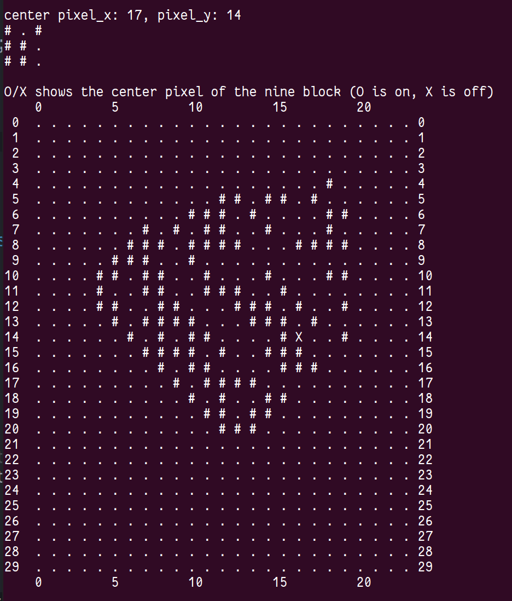
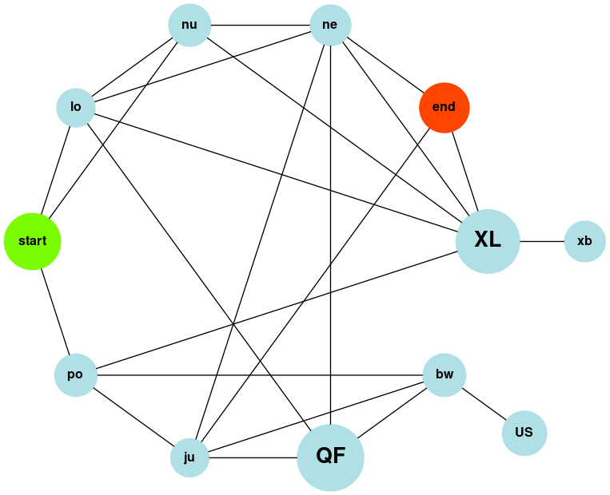

# What is this repo

These are my [Advent Of Code](https://www.adventofcode.com) solutions. A series of daily programming challenges that runs in December.  
I did 2017 and 2018 in [clojure](https://clojure.org/), 2016, 2019 and 2020 in [Haskell](https://www.haskell.org/), and 2021 in [Rust](https://www.rust-lang.org/).
Huge props to AOC creator Eric Wastl. Not only has it been a ton of fun, it also (drastically) improved my programming and problem solving skills.

### Advent of Code ?

[adventofcode.com/about](https://adventofcode.com/about)

>"Advent of Code is an Advent calendar of small programming puzzles
>for a variety of skill sets and skill levels that can be solved in
>any programming language you like. People use them as a speed
>contest, interview prep, company training, university coursework,
>practice problems, or to challenge each other."

### Some visualizations

[2021 --- Day 11: Dumbo Octopus ---](https://adventofcode.com/2021/day/11)

>"You enter a large cavern full of rare bioluminescent dumbo
>octopuses! They seem to not like the Christmas lights on your
>submarine, so you turn them off for now.  There are 100 octopuses
>arranged neatly in a 10 by 10 grid. Each octopus slowly gains energy
>over time and flashes brightly for a moment when its energy is
>full. Although your lights are off, maybe you could navigate through
>the cave without disturbing the octopuses if you could predict when
>the flashes of light will happen."

[2021 --- Day 5: Hydrothermal Venture ---](https://adventofcode.com/2021/day/5)

>"You come across a field of hydrothermal vents on the ocean floor!
>These vents constantly produce large, opaque clouds, so it would be
>best to avoid them if possible."

[2021 --- Day 20: Trench Map ---](https://adventofcode.com/2021/day/20)

>"With the scanners fully deployed, you turn their attention to
>mapping the floor of the ocean trench. Through advances in imaging
>technology, the images being operated on here are infinite in
>size. Truly incredible - now the small details are really starting to
>come through."

[2021 --- Day 12: Passage Pathing ---](https://adventofcode.com/2021/day/12)

>With your submarine's subterranean subsystems subsisting
>suboptimally, the only way you're getting out of this cave anytime
>soon is by finding a path yourself. Not just a path - the only way to
>know if you've found the best path is to find all of them.

[2021 --- Day 25: Sea Cucumber ---](https://adventofcode.com/2021/day/25)

>"Sea cucumbers? Yeah, they're probably hunting for food. But don't
>worry, they're predictable critters: they move in perfectly straight
>lines, only moving forward when there's space to do so. They're
>actually quite polite!"  You explain that you'd like to predict when
>you could land your submarine.

